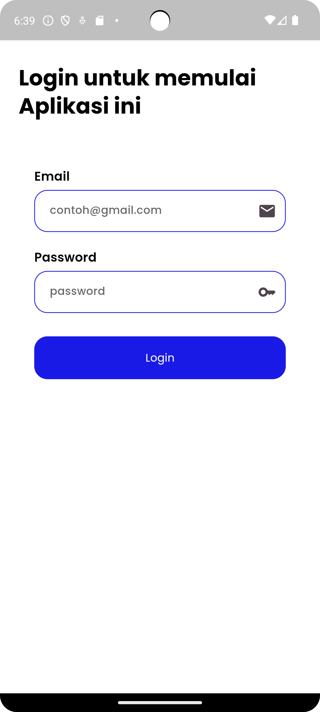

# Baby Nutrition Tracker

A baby nutrition tracker app to monitor and track the nutrition intake of babies.

<div style="text-align:center">
  
</div>

## Technologies Used

- Flutter: Cross-platform framework for mobile app development.
- Firebase Firestore: Real-time NoSQL cloud database for data storage.
- Firebase Authentication: User authentication and authorization.
- Provider: State management solution for Flutter apps.
- Charts_flutter: Library for visualizing data with charts.

## Installation

1. **Clone Repository:**

   ```bash
   git clone https://github.com/yourusername/baby_nutrition_tracker.git

2. **Navigate to Project Directory:**
    ```bash
   cd baby_nutrition_tracker
3. **Install Dependencies:**
    ```bash
   flutter pub get
4. **Run the App**
    ```bash
   flutter run

## Usage
* Sign up or log in to start using the app.
* Add your baby's profile and begin tracking nutrition activities.
* Use the dashboard to view logs and insights.
* Set reminders for feeding times and other activities.

## Screenshots

=======
# nutribaby_app

Nutrisi Bayi

## Getting Started

This project is a starting point for a Flutter application.

A few resources to get you started if this is your first Flutter project:

- [Lab: Write your first Flutter app](https://docs.flutter.dev/get-started/codelab)
- [Cookbook: Useful Flutter samples](https://docs.flutter.dev/cookbook)

For help getting started with Flutter development, view the
[online documentation](https://docs.flutter.dev/), which offers tutorials,
samples, guidance on mobile development, and a full API reference.
>>>>>>> 99642e5d7430ea2ab985ed9ed4d409c243a95a6b
